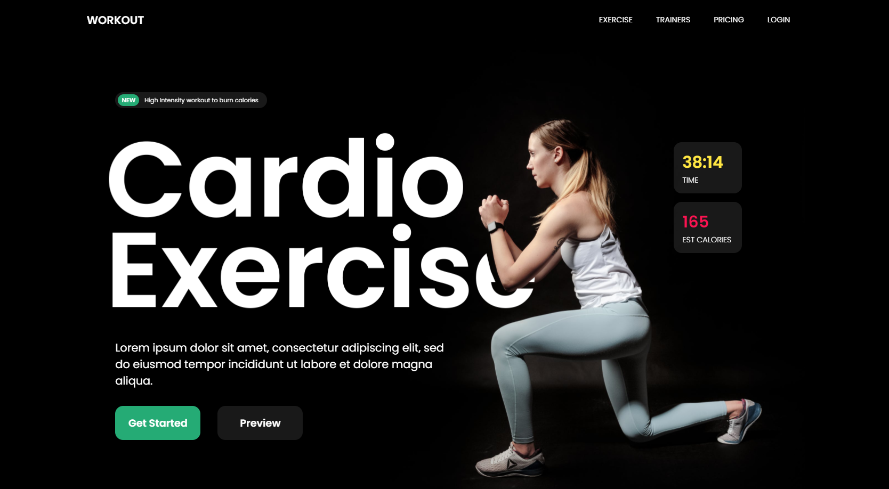
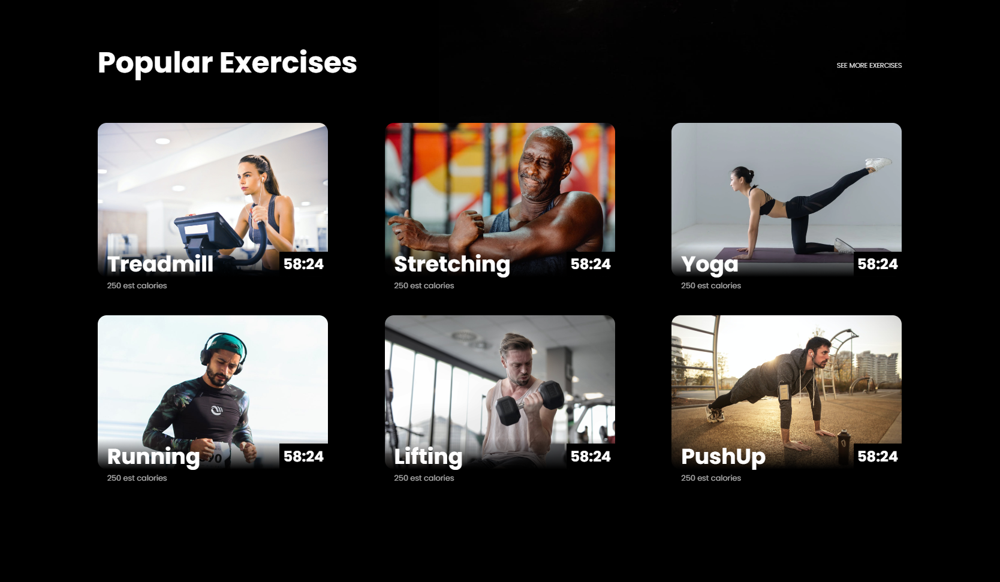
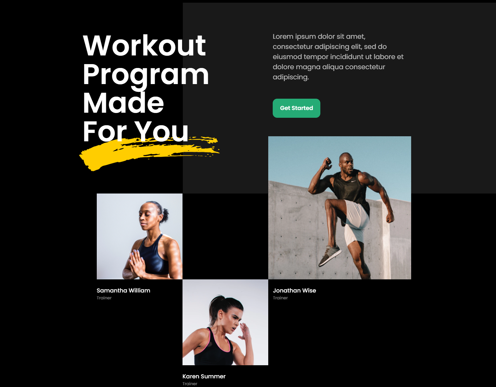
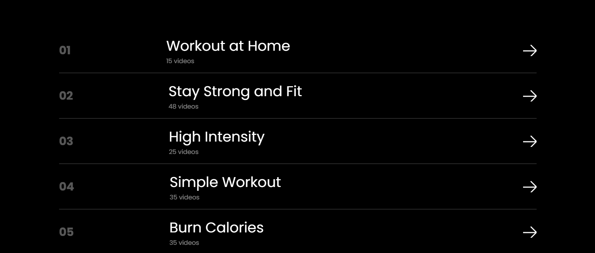

# Gym Landing Page

This is a simple gym landing page created using HTML and CSS. It provides basic information about the gym, its services, and contact details.

## Features

- **Responsive Design**: The page is designed to adapt to different screen sizes (desktop, tablet, and mobile).
- **Navigation Menu**: A navigation menu allows users to explore different sections of the website.
- **Hero Section**: A visually appealing hero section with a background image and a call-to-action button.
- **Popular Exercises Section**: Highlights popular exercises with descriptions and how-to videos.
- **Workout Programs Section**: Outlines workout programs for different fitness goals.
- **Footer**: Includes social media links and copyright information.

## Technologies Used

    HTML5
    CSS3
    JavaScript (potentially, for additional functionality)

    

To run the website locally on your machine, follow these simple steps:

1. **Clone the Repository**: Use `git clone` to copy the repository to your local machine.

2. **Navigate to the Project Directory**: Open a terminal or command prompt, navigate to the project directory, and run `landing-page`.

3. **Open the HTML File**: You can open the `index.html` file in your favorite web browser to view the website locally.

   <h1 align = "center"> ✨THANK YOU✨ </h1>

