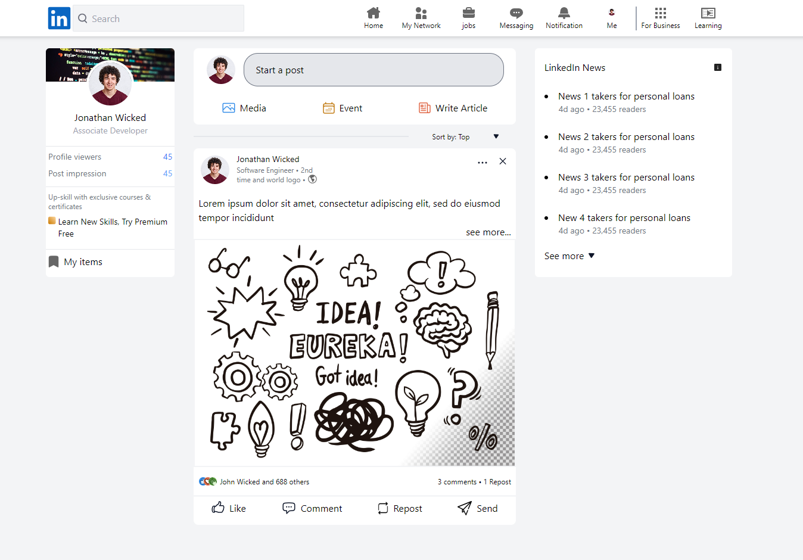

# LinkedIn Landing Page Website clone

Simple LinkedIn landing Page Website Clone with TailwindCSS and HTML for educational purposes

### Features:

- **Navigation Bar**: A sleek navigation bar at the top of the page provides easy access to different sections of the website.
  
- **Hero Section**: The hero section with three layout i.e profile, post feed and news section
  

### Installation:

To run the website locally on your machine, follow these simple steps:

1. **Clone the Repository**: Use `git clone` to copy the repository to your local machine.

2. **Navigate to the Project Directory**: Open a terminal or command prompt, navigate to the project directory, and run `cd linkedIn-landing-page`.

3. **Open the HTML File**: You can open the `index.html` file in your favorite web browser to view the website locally.
