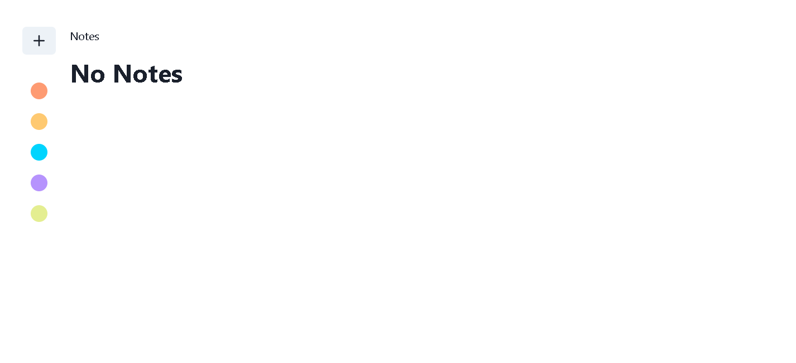
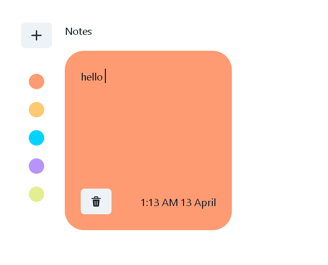
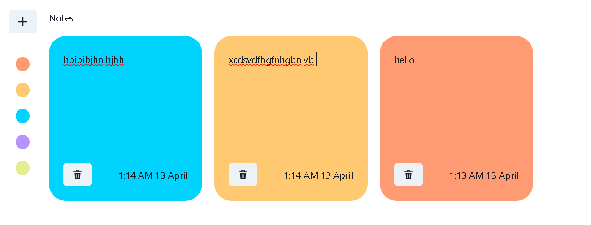

# Notes App

The Notes App is a simple web application that allows users to create, read, update, and delete notes. It provides a user-friendly interface for managing personal notes.

## Features

- **Create Note:** Users can add new notes by entering text into the input field and clicking the "Add" button.
- **Read Note:** Existing notes are displayed in a list format with their content visible to the user.
- **Update Note:** Currently, the update functionality is not implemented in the app.
- **Delete Note:** Users can delete a note by clicking the delete button next to the respective note.

## Technologies Used

- **React:** The front-end of the application is built using React, a popular JavaScript library for building user interfaces.
- **Axios:** Axios is used to make HTTP requests to a mock backend server for CRUD operations.
- **JSONPlaceholder:** JSONPlaceholder is a fake online REST API for testing and prototyping. It is used to simulate the backend server for this application.
- **CSS:** Basic CSS styles are applied to improve the visual appearance of the app.

## Installation

1. Clone the repository:

