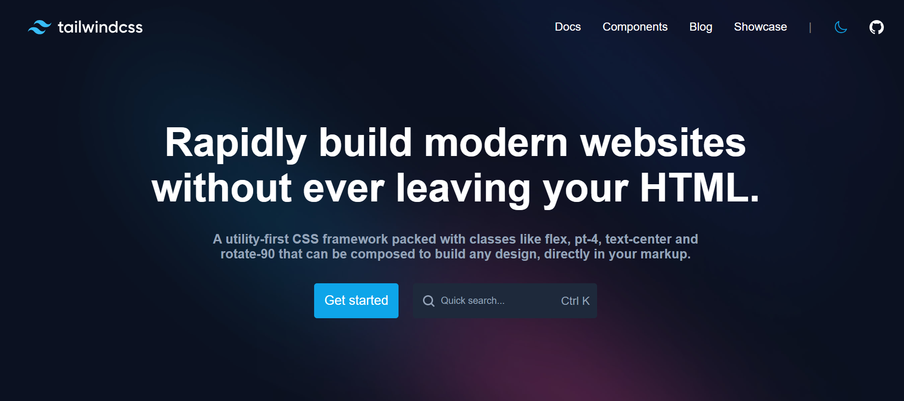

# Tailwind CSS Landing Page Website
Simple Landing Page Website Clone of the Tailwind CSS Website for Educational Purposes.

### Features:

- **Navigation Bar**: A sleek navigation bar at the top of the page provides easy access to different sections of the website.
  
- **Hero Section**: The hero section is the first thing visitors see when they land on the page. It features a captivating headline and a brief description of Tailwind CSS.
  
- **Call to Action Button**: A prominent "Get started" button encourages visitors to take action and explore further along with search input field.

### Installation:

To run the website locally on your machine, follow these simple steps:

1. **Clone the Repository**: Use `git clone` to copy the repository to your local machine.

2. **Navigate to the Project Directory**: Open a terminal or command prompt, navigate to the project directory, and run `cd tailwind-css-landing-page`.

3. **Open the HTML File**: You can open the `index.html` file in your favorite web browser to view the website locally.

